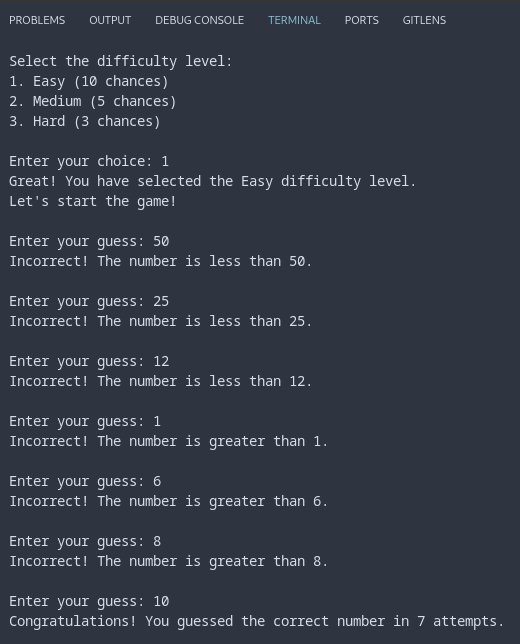

# number_guessing_game

> [!NOTE]
> This is a sample solution to [number-guessing-game](https://roadmap.sh/projects/number-guessing-game) challenge by [roadmap.sh](roadmap.sh)

## HOW TO RUN

Run on terminal:

```bash
python3 game.py
```

## GAME EXAMPLE

